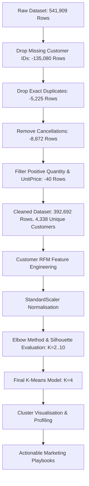
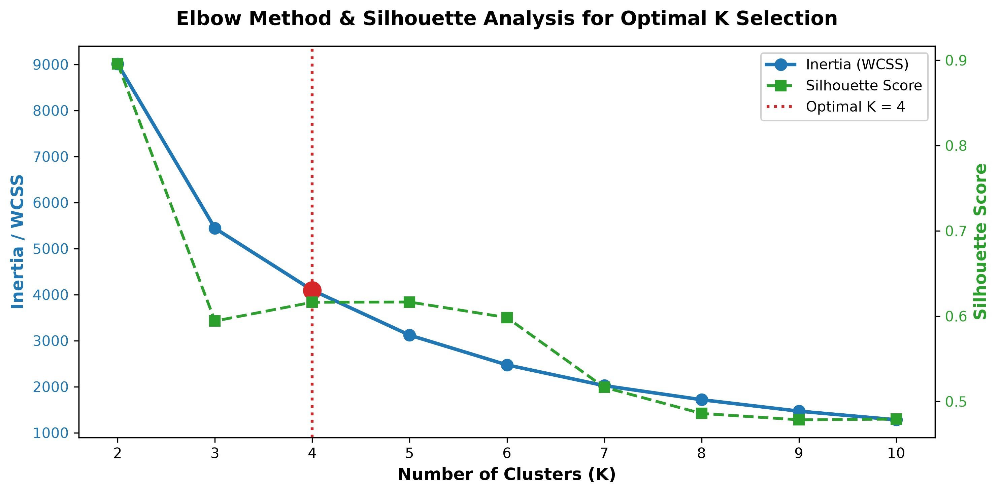
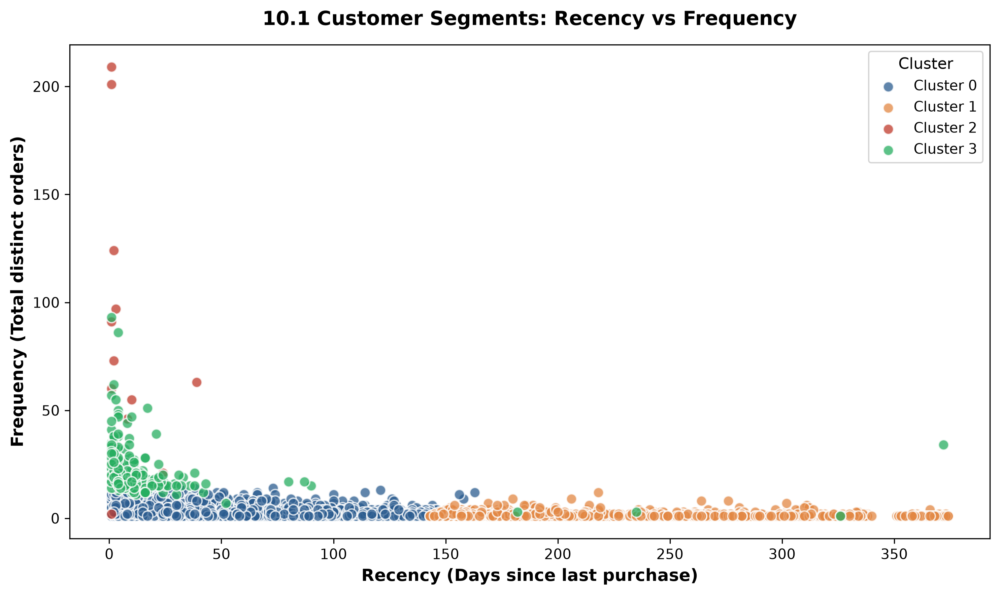
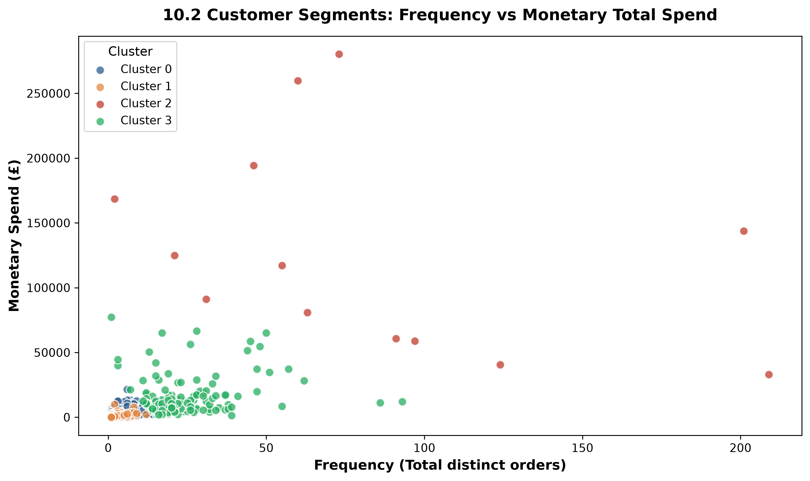
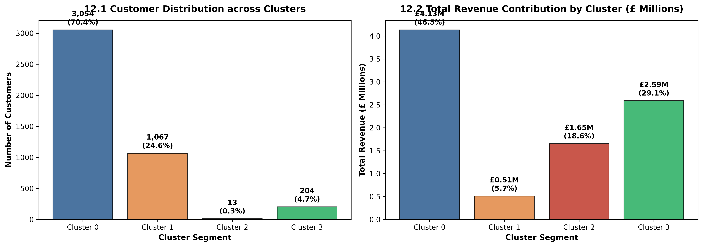
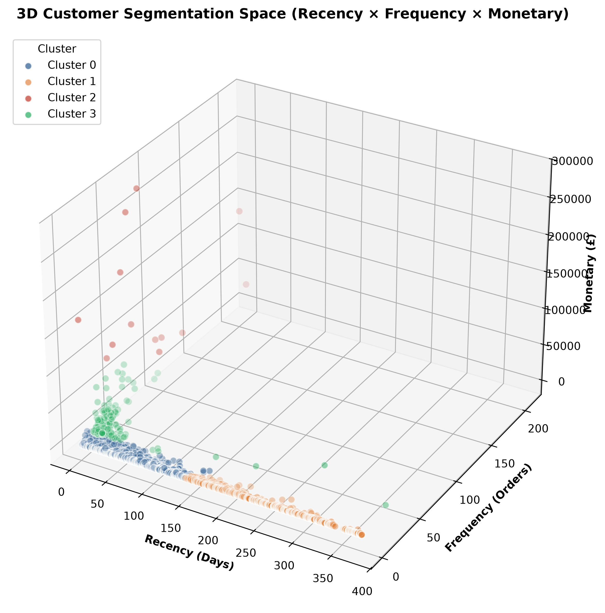

# 🛍️ Customer Segmentation Analysis using RFM & K-Means Clustering

[](https://www.python.org/)
[](https://jupyter.org/)
[](https://scikit-learn.org/)
[](https://pandas.pydata.org/)
[]()

> **OASIS INFOBYTE Data Analytics Internship — Task 2**  
> *A production-grade, end-to-end unsupervised machine learning pipeline to segment e-commerce customers based on behavioural purchasing patterns and design high-impact targeted marketing strategies.*

---

## 📌 Executive Summary

Modern e-commerce enterprises process hundreds of thousands of transactions across diverse consumer segments. Employing a generic, uniform marketing strategy leads to misallocated ad spend, customer churn, and suboptimal Customer Lifetime Value (CLV).

This project develops an end-to-end **Customer Segmentation Pipeline** leveraging the **UCI Online Retail Dataset** (541,909 raw transaction logs, 4,338 cleaned unique customers). By engineering **RFM (Recency, Frequency, Monetary)** features, standardizing feature variance with **StandardScaler**, and applying **K-Means Clustering** evaluated via the **Elbow Method** and **Silhouette Analysis**, we partitioned the customer base into **4 distinct, actionable behavioural segments**:

1. **Cluster 0 — Active Regular Buyers (70.4% Base | 46.5% Revenue)**: Steady repeat shoppers driving everyday cashflow.
2. **Cluster 1 — At-Risk / Hibernating Customers (24.6% Base | 5.8% Revenue)**: Inactive for ~8+ months, requiring urgent win-back campaigns.
3. **Cluster 2 — Wholesale Elite VIPs (0.3% Base | 18.6% Revenue)**: Ultra-high volume B2B / wholesale accounts requiring white-glove concierge account management.
4. **Cluster 3 — High-Frequency Loyalists (4.7% Base | 29.1% Revenue)**: High-margin power shoppers driving premium basket sizes.

---

## 📊 Dataset Overview & Provenance

- **Source**: [UCI Machine Learning Repository — Online Retail Dataset](https://archive.ics.uci.edu/dataset/352/online+retail)
- **Time Horizon**: December 1, 2010 to December 9, 2011
- **Domain**: UK-based registered online retailer specializing in unique all-occasion gifts.
- **Attributes**:
  - `InvoiceNo`: 6-digit transaction identifier (prefix `'C'` denotes cancellation).
  - `StockCode`: Distinct product identifier.
  - `Description`: Item description.
  - `Quantity`: Number of units purchased per transaction.
  - `InvoiceDate`: Timestamp of transaction generation.
  - `UnitPrice`: Unit price in British Pounds Sterling (£).
  - `CustomerID`: Unique 5-digit customer identifier.
  - `Country`: Customer's country of residence.

---

## ⚙️ Data Cleaning & Pipeline Flow



### Data Cleansing Summary Table

| Cleaning Stage | Rows Remaining | Impact / Rationale |
|:---|:---:|:---|
| **Raw Ingestion** | 541,909 | Raw logs from UCI archive |
| **Drop Missing `CustomerID`** | 406,829 | Unidentified guest checkout transactions cannot be mapped to customer profiles |
| **Drop Exact Duplicates** | 401,604 | Eliminates redundant transaction logging |
| **Remove Cancellations (`InvoiceNo` starts with 'C')** | 392,732 | Isolates completed purchases from order reversals |
| **Filter `Quantity > 0` & `UnitPrice > 0`** | **392,692** | Eliminates damaged goods adjustments and system entries |

---

## 🧠 RFM Feature Engineering & Methodology

For each of the **4,338 unique customers**, we compute three core behavioural metrics using a snapshot reference date of `2011-12-10` (one day after the final transaction):

1. **Recency ($R$)**: Days since the customer's most recent transaction:
   $$\text{Recency} = (\text{Reference Date} - \max(\text{InvoiceDate})) \text{ in days}$$
2. **Frequency ($F$)**: Total number of distinct, unique purchase orders:
   $$\text{Frequency} = \text{Count}(\text{Unique } \text{InvoiceNo})$$
3. **Monetary ($M$)**: Total monetary spend across all transactions:
   $$\text{Monetary} = \sum (\text{Quantity} \times \text{UnitPrice})$$

### Feature Standardisation
Because monetary spending spans orders of magnitude (£3.75 to £280,206.02) compared to recency (1 to 374 days) and frequency (1 to 209 orders), we apply `StandardScaler` to ensure unbiased Euclidean distance calculation in K-Means:
$$z = \frac{x - \mu}{\sigma}$$

---

## 📈 Model Optimization: Elbow Method & Silhouette Analysis

We evaluated candidate cluster counts $K \in [2, 10]$:

| $K$ | Inertia (WCSS) | Silhouette Score | Evaluation |
|:---:|:---:|:---:|:---|
| **2** | 9,014.57 | 0.8958 | Over-aggregated; obscures mid-tier loyalists |
| **3** | 5,441.32 | 0.5942 | Good separation, but lumps wholesale and retail VIPs |
| **4** | **4,096.30** | **0.6162** | **Optimal inflection point (Elbow); distinct personas** |
| **5** | 3,119.79 | 0.6165 | Fragmented cluster definitions |
| **6** | 2,473.79 | 0.5983 | Diminishing returns; over-segmentation |



---

## 🎯 Empirical Cluster Profiles & Business Personas

| Cluster | Customer Persona | Customer Count | % Customer Base | Avg Recency (Days) | Avg Frequency (Orders) | Avg Monetary (£) | Total Revenue (£) | % Total Revenue |
|:---:|:---|:---:|:---:|:---:|:---:|:---:|:---:|:---:|
| **Cluster 0** | **Active Regular Buyers** | 3,054 | 70.40% | 43.7 | 3.68 | £1,353.63 | £4,133,971.70 | **46.52%** |
| **Cluster 1** | **At-Risk / Hibernating** | 1,067 | 24.60% | 248.1 | 1.55 | £478.85 | £510,931.64 | **5.75%** |
| **Cluster 2** | **Wholesale Elite VIPs** | 13 | 0.30% | 7.4 | 82.54 | £127,187.96 | £1,653,443.47 | **18.61%** |
| **Cluster 3** | **High-Frequency Loyalists** | 204 | 4.70% | 15.5 | 22.33 | £12,690.50 | £2,588,862.08 | **29.13%** |
| **Total** | — | **4,338** | **100.0%** | **92.5** | **4.27** | **£2,048.69** | **£8,887,208.89** | **100.0%** |

---

## 🖼️ Visualizations

### 1. Recency vs Frequency


### 2. Frequency vs Monetary Spend


### 3. Customer Distribution & Revenue Share


### 4. 3D RFM Feature Space


---

## 🚀 Recommended Marketing Actions

| Cluster | Customer Persona | Strategic Goal | Recommended Marketing Tactic | Priority Playbook |
|:---|:---|:---|:---|:---|
| **Cluster 0** | **Active Regulars** | Increase basket size & repeat purchase frequency | Personalized cross-selling widgets ("Frequently Bought Together"), tiered threshold free shipping (£50+). | Tiered Loyalty Rewards |
| **Cluster 1** | **At-Risk / Dormant** | Win back slipping accounts before permanent churn | Automated time-decay re-engagement email sequence (20% off at 60 days, 30% off at 120 days), feedback surveys. | Automated 60-Day Reactivation Trigger |
| **Cluster 2** | **Wholesale VIPs** | Maximise account retention & contractual volume | Dedicated white-glove B2B account managers, Net-30/60 corporate invoicing terms, bulk discounts. | White-Glove Concierge & Custom Pricing |
| **Cluster 3** | **High-Frequency Loyalists** | Deepen brand advocacy & lifetime spend | VIP Club status, early access to new seasonal collections, premium gift wrapping, referral perks. | Exclusive VIP Advocacy Program |

---

## 🔍 Key Findings & Business Insights

1. **Pareto Value Concentration**:
   - The top two tiers (**Cluster 2 Wholesale VIPs** + **Cluster 3 Loyalists**) represent only **5.0% of the customer base** (217 clients), yet they drive **47.74% of total company revenue** (£4.24M out of £8.89M).
2. **The Core Engine**:
   - **Cluster 0 (Active Regulars)** accounts for **70.4% of users (3,054)** and generates **£4.13M (46.52%)** in revenue, serving as the everyday financial backbone.
3. **Massive Churn Recovery Opportunity**:
   - **1,067 customers (24.6%)** are dormant with an average inactivity of **8.2 months (248 days)**. Reactivating just 10% of this segment could reclaim over **£50,000–£100,000** in gross revenue.

---

## 📁 Repository Structure

```
Customer_Segmentation_Analysis/
├── Customer_Segmentation_Analysis.ipynb   # Master executed Jupyter Notebook (All 16 sections)
├── build_and_execute_notebook.py          # Automated notebook builder and headless execution engine
├── generate_assets.py                     # High-resolution figure generation script
├── requirements.txt                       # Project Python dependencies
├── README.md                              # Comprehensive project documentation
├── data/                                  # Dataset repository
│   ├── Online_Retail.csv                  # Cleaned CSV format (instant loading)
│   └── Online Retail.xlsx                 # Official UCI Excel source archive
└── screenshots/                               # Exported publication-grade visualizations
    ├── 01_rfm_correlation_matrix.png
    ├── 02_elbow_silhouette_plot.png
    ├── 03_recency_vs_frequency.png
    ├── 04_frequency_vs_monetary.png
    ├── 05_customer_revenue_distribution.png
    └── 06_3d_rfm_clusters.png
```

---

## 💻 How to Run

### 1. Clone or Open Workspace
```bash
cd c:/Users/nikhi/OneDrive/Desktop/Internship_project/Customer_Segmentation_Analysis
```

### 2. Install Dependencies
```bash
pip install -r requirements.txt
```

### 3. Launch Jupyter Notebook
```bash
jupyter notebook Customer_Segmentation_Analysis.ipynb
```
*Or open directly in VS Code / Cursor / Antigravity IDE and run all cells.*

---

## 🛠️ Tech Stack

- **Core**: Python 3.9+
- **Data Engineering**: pandas, numpy, openpyxl
- **Machine Learning**: scikit-learn (`KMeans`, `StandardScaler`, `silhouette_score`)
- **Data Visualization**: matplotlib, seaborn
- **Notebook Environment**: Jupyter / IPython

---

## 📜 Submission Details

- **Internship**: OASIS INFOBYTE Data Analytics
- **Task**: Task 2 — Customer Segmentation Analysis
- **Domain**: E-Commerce & Retail Analytics
- **Model**: RFM Feature Engineering + K-Means Clustering
- **Status**: ✅ Completed & Verified End-to-End
